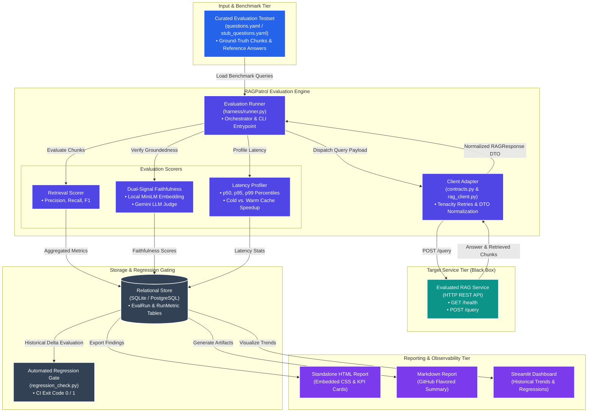
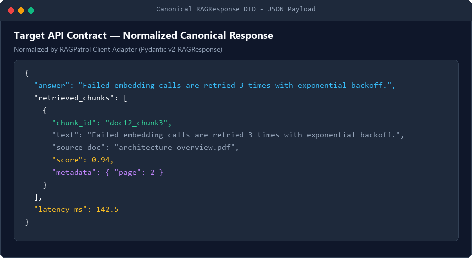
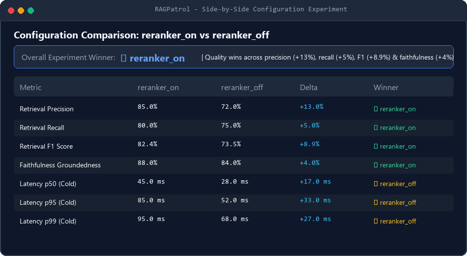
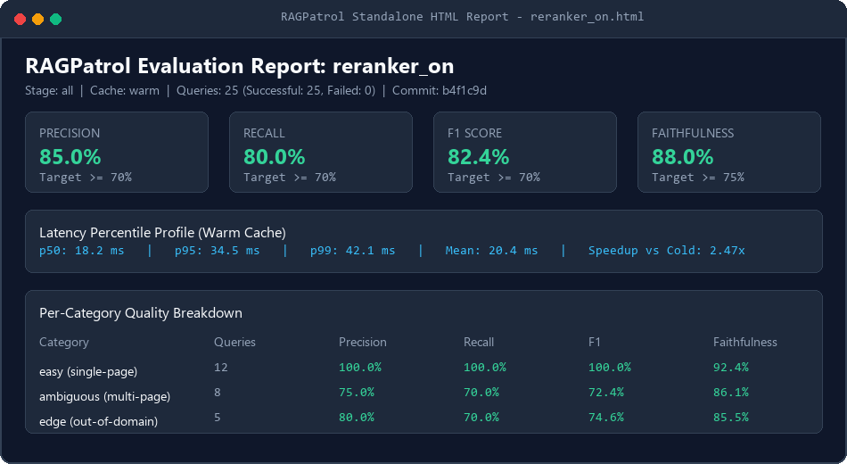
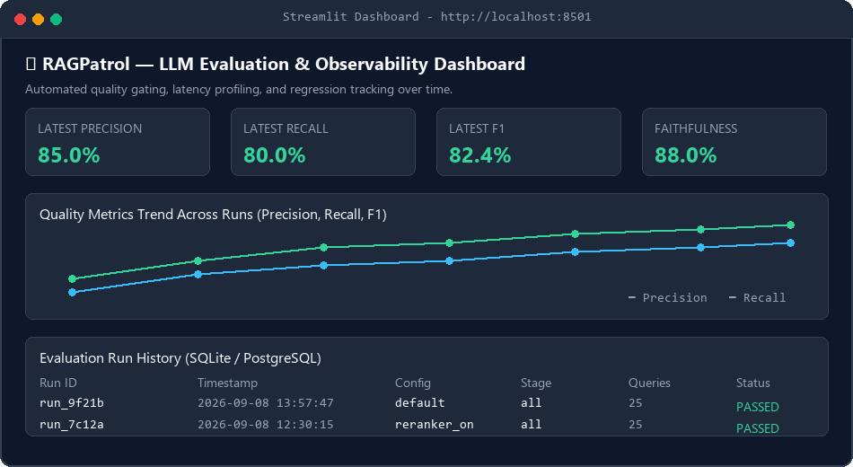
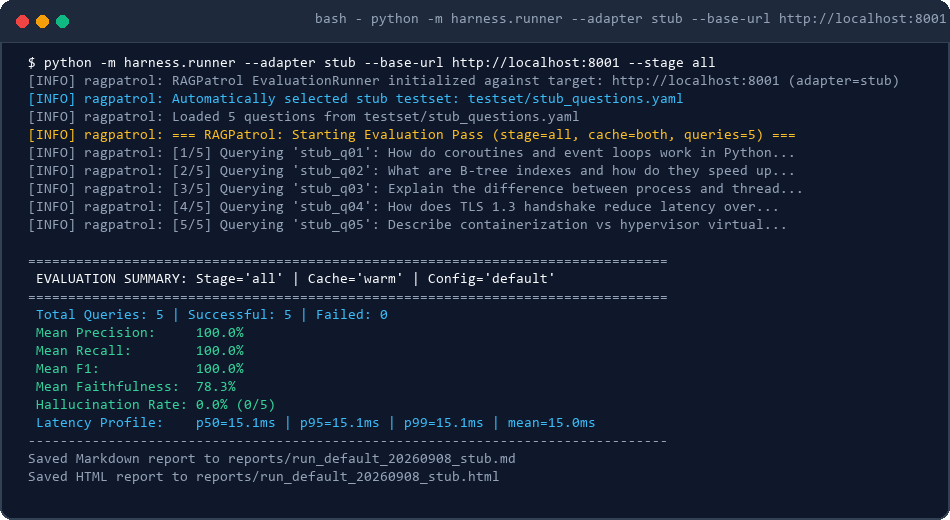
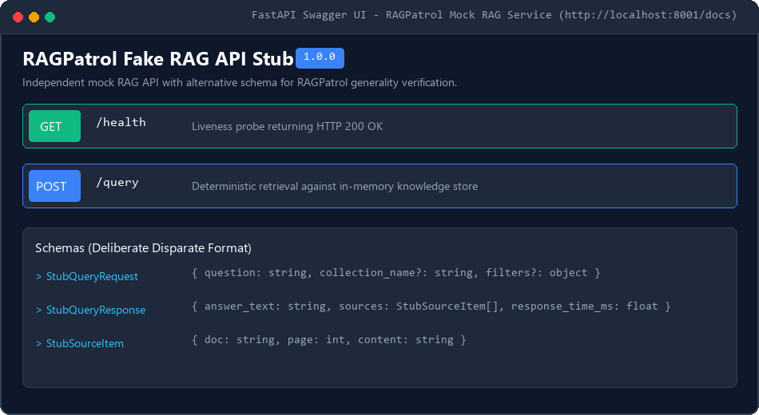
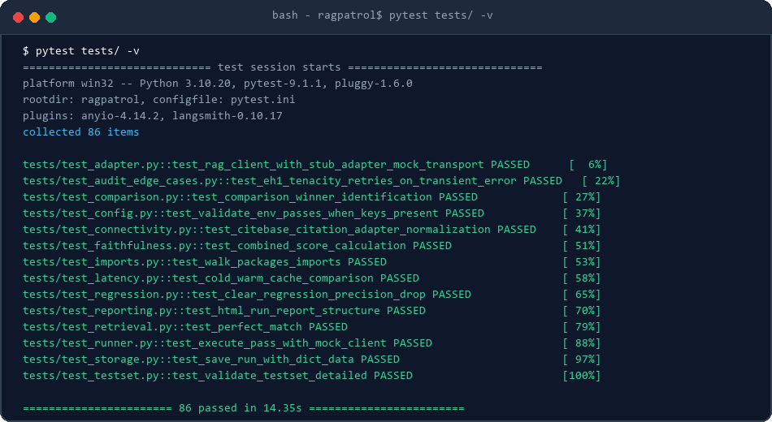

# RAGPatrol — LLM Evaluation & Observability Harness

<blockquote>Automated Quality Gating, Faithfulness Auditing, and Latency Profiling for Production RAG Systems</blockquote>

<p align="left">
  
  
  
  
</p>

**RAGPatrol** is a surgical regression gating and observability harness designed to evaluate black-box Retrieval-Augmented Generation (RAG) systems across retrieval precision/recall/F1, answer faithfulness, and latency percentiles. It persists benchmark runs over time in SQLite or PostgreSQL, supports side-by-side configuration comparisons, and gates CI/CD pipelines against quality degradations.

---

## 📖 Documentation Site

A static documentation site is available at:
**[https://GurutejaReddy-04.github.io/ragpatrol/](https://GurutejaReddy-04.github.io/ragpatrol/)**

This site provides a quick overview of the project, key features, and links to the evaluation harness documentation.

---

## Key Features

- **Vendor-Agnostic Black-Box Evaluation:** Queries any RAG service adhering to a lightweight HTTP contract (`GET /health`, `POST /query`).
- **Dual-Signal Faithfulness Auditing:** Combines local semantic embedding similarity (`sentence-transformers/all-MiniLM-L6-v2`) with LLM-as-a-judge verification (Google Gemini) to detect hallucinations without open-world conflation.
- **Latency Percentile Profiling:** Profiles p50, p95, and p99 response times with cold-cache vs. warm-cache comparison and speedup factor computation.
- **Automated Regression Gating:** Evaluates run deltas against statistical thresholds and exits with non-zero status codes to block CI/CD regressions.
- **Side-by-Side Configuration Experiments:** Compares two system configurations (e.g., reranker enabled vs. disabled) across quality metrics and per-category breakdowns.
- **Multi-Format Reporting:** Exports zero-dependency standalone HTML reports with interactive CSS row-highlighting and print-to-PDF styles, plus GitHub-flavored Markdown artifacts.
- **Generality Proof:** Ships with an independent stub application (`stub_app/fake_rag_api.py`) implementing an alternative schema to prove reusability across disparate architectures.

---

## Important Scope Note

> [!IMPORTANT]
> **Faithfulness is NOT fact-checking.**
> Faithfulness scoring measures whether the generated answer is strictly grounded in the retrieved context chunks provided to the LLM. It does not perform independent open-world truth verification. Conflating these two concepts is a common pitfall that RAGPatrol explicitly avoids.

---

## System Architecture



---

## Target API Contract

RAGPatrol treats any evaluated RAG service as a black box adhering to this standard HTTP interface:

### 1. Health Probe
- **Method:** `GET /health`
- **Response:** `{"status": "ok"}`

### 2. Query Endpoint
- **Method:** `POST /query`
- **Request Body:**
  ```json
  {
    "question": "What is the retry policy for failed embeddings?",
    "collection_name": "engineering-docs"
  }
  ```
- **Canonical Response Body:**
  ```json
  {
    "answer": "Failed embedding calls are retried 3 times with exponential backoff.",
    "retrieved_chunks": [
      {
        "chunk_id": "doc12_chunk3",
        "text": "Failed embedding calls are retried 3 times with exponential backoff.",
        "source_doc": "architecture_overview.pdf",
        "score": 0.94,
        "metadata": {
          "page": 2
        }
      }
    ],
    "latency_ms": 142.5
  }
  ```



---

## Quick Start

### 1. Installation

Clone the repository and install dependencies in a Python 3.10+ virtual environment:

```bash
git clone https://github.com/GurutejaReddy-04/ragpatrol.git
cd ragpatrol

python -m venv .venv
# On Linux/macOS:
source .venv/bin/activate
# On Windows:
.venv\Scripts\Activate.ps1

pip install -r requirements.txt
```

### 2. Environment Variables

Create a `.env` file or export your API credentials:

```bash
# Required for live LLM Judge faithfulness scoring (optional in --dry-run mode)
export JUDGE_API_KEY="your-gemini-api-key"

# Optional overrides (replace with your RAG service URL)
export TARGET_BASE_URL="https://your-api.example.com"
export DATABASE_URL="sqlite:///eval_runs.db"
```

### 3. CLI Usage

```bash
# 1. Classical Retrieval Scoring (Precision, Recall, F1)
python -m harness.runner --stage retrieval

# 2. Dual-Signal Faithfulness Scoring (Dry-run mode, embedding proxy)
python -m harness.runner --stage faithfulness --dry-run

# 3. Dual-Signal Faithfulness Scoring (Live Gemini LLM Judge)
python -m harness.runner --stage faithfulness

# 4. Full Pipeline with Cold vs. Warm Latency Comparison
python -m harness.runner --stage all --cache-mode both

# 5. Automated Quality Regression Gate (CI/CD check)
python -m harness.regression_check --config default --stage all

# 6. Side-by-Side Configuration Experiment Comparison
python -m harness.runner --compare reranker_on reranker_off

# 7. Generate Markdown & HTML Reports
python -m harness.runner --report both
```

---

## Configuration

Baseline settings are managed via `pydantic-settings` in [`harness/config.py`](harness/config.py) and loaded from [`config.yaml`](config.yaml). Secrets are strictly injected via environment variables:

```yaml
target_api:
  base_url: "https://your-api.example.com"
  timeout_seconds: 30.0
  max_retries: 3
  retry_backoff_factor: 1.5

testset:
  path: "testset/questions.yaml"

storage:
  database_url: "sqlite:///eval_runs.db"

metrics:
  retrieval:
    min_precision: 0.70
    min_recall: 0.70
    min_f1: 0.70
  faithfulness:
    min_score: 0.75
    embedding_weight: 0.4
    llm_judge_weight: 0.6
  latency:
    max_p95_ms: 2500.0
    max_p99_ms: 5000.0

judge:
  provider: "gemini"
  model: "gemini-2.5-flash"
  temperature: 0.0
```

---

## Regression Detection

RAGPatrol's regression detection module ([`harness/regression_check.py`](harness/regression_check.py)) queries historical run records stored in SQLite/PostgreSQL to detect meaningful quality or latency degradation:

```bash
python -m harness.regression_check --config default --stage all
```

- **Retrieval Thresholds:** Fails if Precision, Recall, or F1 drops by > 5% (0.05).
- **Faithfulness Threshold:** Fails if groundedness score drops by > 10% (0.10).
- **Latency Threshold:** Fails if p95 response time increases by > 20% relative to baseline.
- **CI Exit Code:** Exits with code `0` on pass, or code `1` with formatted delta diagnostics on regression.

---

## Comparison Mode

RAGPatrol enables side-by-side benchmarking of two distinct system configurations (e.g., evaluating the impact of cross-encoder reranking or vector quantization):

```bash
python -m harness.runner --compare reranker_on reranker_off
```



The comparator highlights metric winners across quality and speed dimensions, computes percentage deltas, and isolates trade-offs across question categories (`easy`, `ambiguous`, `edge`).

---

## Reporting

RAGPatrol automatically generates self-contained reports in both GitHub-flavored Markdown and HTML formats.

### HTML Report Preview
The HTML report contains embedded CSS (zero external CDN dependencies), interactive hover highlighting, KPI scorecards, category drill-downs, and print-to-PDF stylesheets:



```bash
# Open generated HTML report in your default browser
python -m harness.runner --report html
```

### Streamlit Trend & KPI Dashboard
RAGPatrol also includes an interactive Streamlit dashboard ([`harness/reporting/dashboard.py`](harness/reporting/dashboard.py)) for inspecting historical runs, metric trends, and flagged hallucinations:



```bash
# Launch interactive evaluation dashboard
streamlit run harness/reporting/dashboard.py
```

---

## Proving Generality

A common failure mode in evaluation tooling is tight coupling to a single system's internal API contract. To prove that RAGPatrol is **truly vendor-agnostic**, the project includes an independent stub application ([`stub_app/fake_rag_api.py`](stub_app/fake_rag_api.py)) exposing a deliberately different schema, paired with a dedicated 5-question test set ([`testset/stub_questions.yaml`](testset/stub_questions.yaml)).

### Disparate Schema Comparison

| Dimension | Production System (CiteBase) | Independent Stub (`fake_rag_api`) | Canonical RAGPatrol DTO |
| :--- | :--- | :--- | :--- |
| **Endpoint** | `https://your-api.example.com/query` | `http://localhost:8001/query` (local test stub) | Configurable / `--base-url` |
| **Answer Key** | `"answer"` | `"answer_text"` | `RAGResponse.answer` |
| **Citations List** | `"sources": [{"source", "page", ...}]` | `"sources": [{"doc", "page", "content"}]` | `RAGResponse.retrieved_chunks` |
| **Latency Metric** | RAGPatrol wall-clock measurement | `"response_time_ms": float` | `RAGResponse.latency_ms` |

### Running Against the Stub

```bash
# 1. Start the stub API in the background (port 8001)
python -m stub_app.fake_rag_api

# 2. Run the full RAGPatrol evaluation against the stub (replace with your actual API URL if testing remote)
python -m harness.runner --adapter stub --base-url http://localhost:8001 --stage all
```



### OpenAPI Contract Preview
The stub service serves an interactive OpenAPI / Swagger UI on port 8001:



> [!NOTE]
> **Generality Validation Guarantee:**
> "RAGPatrol was validated against two independent systems: CiteBase and the stub app, proving it is a general-purpose evaluation tool."

---

## Testing

RAGPatrol includes an extensive automated test suite covering unit logic, resilience, network retries, Pydantic DTO normalization, and edge cases with zero external service dependencies:

```bash
# 1. Validate ground-truth dataset integrity and schema invariants
python testset/validate_testset.py

# 2. Run the complete pytest test suite (86 tests)
pytest tests/ -v
```



---

## CI/CD Integration

RAGPatrol is configured to gate pull requests and pushes via GitHub Actions ([`.github/workflows/eval.yml`](.github/workflows/eval.yml)):

```yaml
name: RAGPatrol CI & Regression Gate

on:
  push:
    branches: [ main, master ]
  pull_request:
    branches: [ main, master ]

jobs:
  evaluate:
    runs-on: ubuntu-latest
    steps:
      - uses: actions/checkout@v4
      - uses: actions/setup-python@v5
        with:
          python-version: "3.11"
      - run: pip install -r requirements.txt
      - run: python testset/validate_testset.py
      - run: python -m pytest tests/ -v
      - name: Generality & Dry-Run Verification
        run: |
          python -m uvicorn stub_app.fake_rag_api:app --host 127.0.0.1 --port 8001 &
          sleep 2
          python -m harness.runner --adapter stub --base-url http://127.0.0.1:8001 --stage all --dry-run
```

---

## Repository Structure

```text
ragpatrol/
├── .github/
│   └── workflows/
│       └── eval.yml               # Automated CI regression gate
├── docs/
│   └── images/                    # Documentation screenshots & previews
│       ├── terminal.png
│       ├── comparison-table.png
│       ├── report-html.png
│       ├── stub-app-run.png
│       ├── swagger-ui.png
│       ├── frontend-ui.png
│       ├── query-response.png
│       └── README.md
├── harness/
│   ├── clients/
│   │   ├── contracts.py           # Pydantic v2 canonical DTOs & citation adapters
│   │   └── rag_client.py          # Tenacity-backed HTTP client adapter
│   ├── config.py                  # Pydantic-settings configuration loader
│   ├── exceptions.py              # Domain-specific exceptions
│   ├── regression_check.py        # Automated quality regression detector & CI gate
│   ├── reporting/
│   │   ├── comparison_report.py   # Side-by-side configuration experiment reporter
│   │   ├── dashboard.py           # Streamlit trend & KPI dashboard
│   │   ├── html_report.py         # Standalone HTML report generator (embedded CSS)
│   │   └── markdown_report.py     # GitHub-flavored Markdown report generator
│   ├── runner.py                  # Evaluation orchestrator and CLI entrypoint
│   ├── scorers/
│   │   ├── faithfulness.py        # Faithfulness (embedding + LLM judge) scorer
│   │   ├── latency.py             # Latency percentile profiler
│   │   └── retrieval.py           # Set-based Precision, Recall, F1 scorer
│   └── storage/
│       ├── db.py                  # Database session manager
│       └── models.py              # SQLAlchemy 2.0 ORM schemas
├── scripts/
│   ├── extract_citebase_testset.py # Extracts and maps CiteBase eval benchmark
│   └── generate_docs_assets.py     # Generates documentation screenshots
├── stub_app/
│   ├── __init__.py                # Stub app package
│   └── fake_rag_api.py            # Standalone FastAPI mock RAG service (port 8001)
├── testset/
│   ├── questions.yaml             # Curated CiteBase ground-truth questions (25 items)
│   ├── stub_questions.yaml        # Dedicated stub test set (5 items)
│   └── validate_testset.py        # Dataset validation and invariant checker
├── tests/
│   ├── test_adapter.py            # Client adapter & stub normalization unit tests
│   ├── test_audit_edge_cases.py   # Regression tests for all audit edge cases
│   ├── test_comparison.py         # Side-by-side comparison unit tests
│   ├── test_config.py             # Configuration & environment validation tests
│   ├── test_connectivity.py       # Live health check & adapter tests
│   ├── test_faithfulness.py       # Dual-signal faithfulness unit tests (mocked)
│   ├── test_imports.py            # Complete import smoke test
│   ├── test_latency.py            # Latency percentile & speedup unit tests
│   ├── test_regression.py         # Regression gating unit tests (in-memory SQLite)
│   ├── test_reporting.py          # Markdown & HTML report structure unit tests
│   ├── test_retrieval.py          # Set-based Precision, Recall, F1 unit tests
│   ├── test_runner.py             # Evaluation runner & CLI orchestration tests
│   ├── test_storage.py            # Database manager & persistence tests
│   └── test_testset.py            # Automated test set schema enforcement
├── config.yaml                    # Public configuration parameters
├── LICENSE                        # MIT License
├── pyproject.toml                 # Ruff, mypy, and build metadata (ragpatrol)
├── pytest.ini                     # Pytest defaults (-v --tb=short)
├── requirements.txt               # Pinned dependencies
└── README.md
```

---

## License

This project is licensed under the MIT License — see the [LICENSE](LICENSE) file for details.
