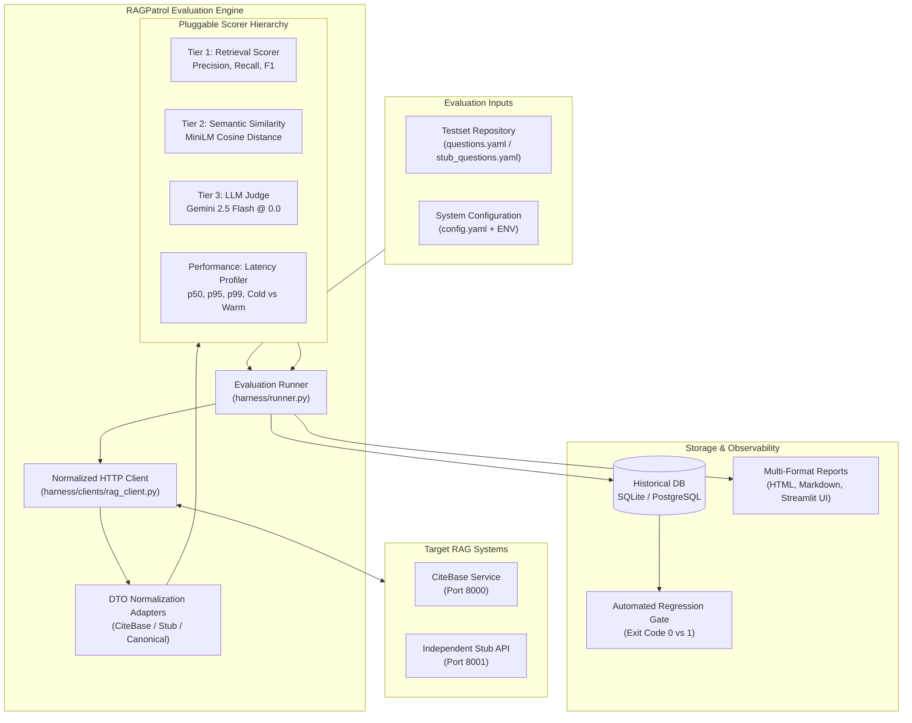
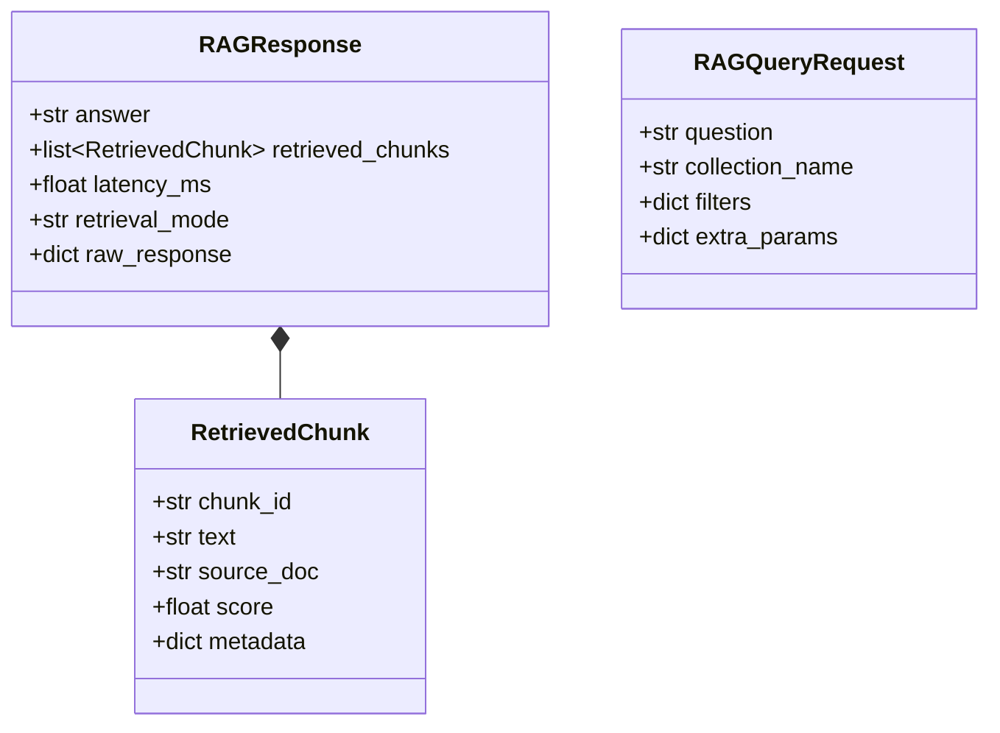
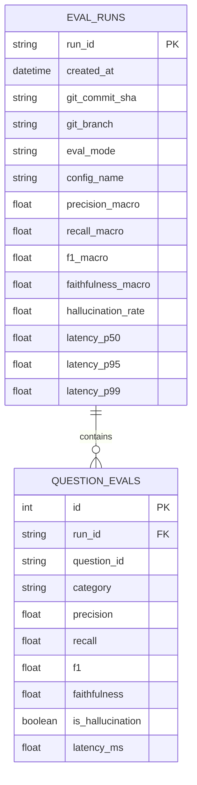

# RAGPatrol System Architecture Specification

> **Version:** 2.0  
> **Status:** Active  
> **Scope:** Black-Box Evaluation Harness, Contract Adapters, Pluggable Scorers, and CI Regression Gating

---

## 1. Architectural Overview & Design Philosophy

RAGPatrol is designed as an **independent, black-box evaluation and observability harness** for Retrieval-Augmented Generation (RAG) applications. Rather than coupling evaluation directly into application runtimes or proprietary vector databases, RAGPatrol operates over standard HTTP interfaces.

### Core Design Principles
1. **Black-Box Decoupling:** Evaluates RAG systems via external query endpoints (`POST /query`), observing only the returned answer, retrieved passage chunks, and wall-clock latency.
2. **Deterministic Metric Grounding:** Measures retrieval quality against curated, invariant ground-truth chunk IDs via set mathematics, independent of stochastic LLM evaluations.
3. **Multi-Signal Faithfulness Auditing:** Combines local deterministic dense embeddings (`all-MiniLM-L6-v2`) with LLM-as-a-judge reasoning (`gemini-2.5-flash` at temperature 0.0).
4. **Longitudinal Persistence & Regression Gating:** Tracks evaluation metrics across Git commits and CI/CD runs in relational storage (SQLite / PostgreSQL) to block quality degradations.
5. **Adapters:** Uses Pydantic to parse different API responses into a standard format.

---

## 2. High-Level Architecture

---

## 3. Pluggable Scorer Subsystems

RAGPatrol classifies evaluation signals into three explicit reliability tiers to prevent conflating objective ground truth with stochastic model outputs:

### Tier 1: Deterministic Retrieval Scorer (`harness/scorers/retrieval.py`)
- Evaluates retrieved chunk IDs against human-annotated ground-truth IDs using unranked set intersection:

$$
\text{TP} = |\text{Retrieved} \cap \text{GroundTruth}|
$$

- Computes Precision, Recall, and harmonic $F_1$. 100% reproducible with zero LLM dependence.

### Tier 2: Semantic Representation Scorer (`harness/scorers/faithfulness.py`)
- Computes local cosine similarity between answer vectors ($\mathbf{u}$) and concatenated retrieved context passages ($\mathbf{v}$) using `sentence-transformers/all-MiniLM-L6-v2`:

$$
\text{Sim}_{\text{emb}} = \max\left(0.0, \min\left(1.0, \frac{\mathbf{u} \cdot \mathbf{v}}{\|\mathbf{u}\|_2 \|\mathbf{v}\|_2}\right)\right)
$$

### Tier 3: Model-Based LLM Judge (`harness/scorers/faithfulness.py`)
- Prompts Google Gemini (`gemini-2.5-flash` at `temperature: 0.0`) with structured JSON instructions to assess context groundedness (rating 1 to 5).
- Combines embedding similarity with judge ratings into composite faithfulness:

$$
\text{Faithfulness Score} = w_{\text{emb}} \cdot \text{Sim}_{\text{emb}} + w_{\text{judge}} \cdot \left(\frac{\text{Score}_{\text{judge}}}{5.0}\right)
$$

### Latency Profiling Subsystem (`harness/scorers/latency.py`)
- Profiles wall-clock query durations over two distinct passes (cold cache vs. warm cache).
- Calculates exact percentiles ($p50$, $p95$, $p99$) and cache speedup factors.

---

## 4. Contract Normalization Architecture

To support disparate target applications without scorer modifications, RAGPatrol defines canonical Pydantic v2 Data Transfer Objects in `harness/clients/contracts.py`:

### Supported Adapter Implementations
1. **CiteBase Service Adapter:** Normalizes citation objects containing `chunk_id`, `rerank_score`, `section`, and `breadcrumb`. Note that while target systems like CiteBase may utilize internal hybrid ranking such as Reciprocal Rank Fusion:

$$
\text{RRF}(d) = \sum_{r \in R} \frac{1}{k + \text{rank}_r(d)}
$$

RAGPatrol evaluates the resulting output set at the HTTP boundary.
2. **Independent Mock Stub Adapter (`fake_rag_api`):** Normalizes an alternative schema (`answer_text`, `sources: [{doc, page, content}]`, `response_time_ms`).
3. **Canonical Adapter:** Direct deserialization of native `RAGResponse` JSON schemas.

---

## 5. Storage Schema & Regression Gating Engine

Evaluation results are persisted to `eval_runs` and `question_evals` tables in SQLite or PostgreSQL:

### Longitudinal Regression Gating Logic
On every CI run:
1. The harness restores the historical evaluation database from GitHub Actions cache (falling back to `fixtures/reference_eval_runs.db`).
2. Computes deltas between the current run and the latest stored baseline:
   - **Retrieval Regression:** Drop in macro $F_1$ or Precision $> 5\%$ triggers failure.
   - **Faithfulness Regression:** Drop in macro Faithfulness $> 10\%$ triggers failure.
   - **Latency Inflation:** Increase in $p95$ response time $> 20\%$ triggers failure.
3. Exits with code `1` upon regression detection, halting downstream deployment pipelines.
