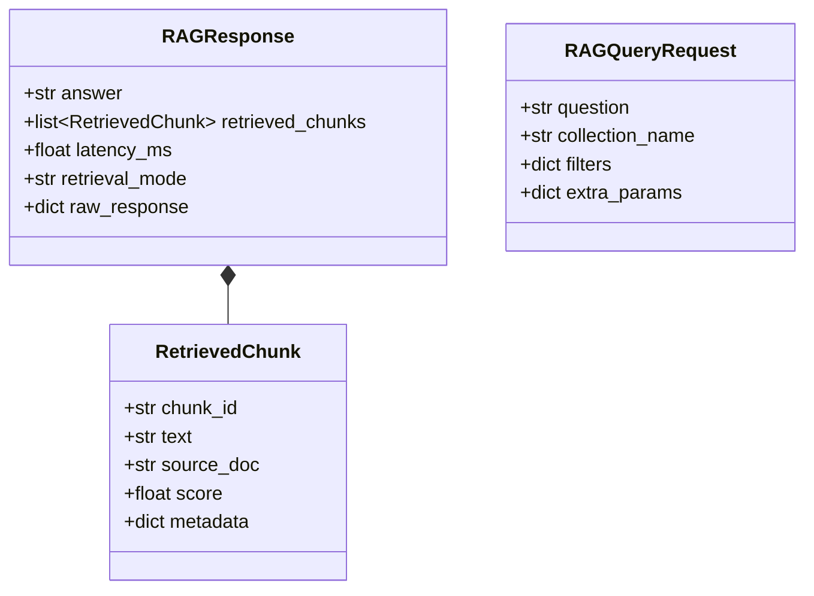

# RAGPatrol Evaluation Methodology Specification

> **Version:** 2.0  
> **Status:** Active  
> **Target Systems:** RAG Services and HTTP Interfaces  
> **Canonical Document:** [`docs/evaluation_methodology.md`](evaluation_methodology.md)

This document defines the mathematical, architectural, and procedural methodology behind **RAGPatrol**'s evaluation metrics, regression gating, and scoring algorithms.

---

## 1. Benchmark Construction

The core evaluation benchmark consists of **25 curated, held-out queries** derived from the CiteBase document intelligence benchmark dataset (`testset/questions.yaml`). A secondary **5-query test set** (`testset/stub_questions.yaml`) accompanies the independent FastAPI test stub (`stub_app/fake_rag_api.py`) to validate interface generalization.

Queries are partitioned according to retrieval complexity:
- **`easy` (Single-page factual retrieval):** Questions where complete answering context resides in a single, well-delimited document page. Designed to verify primary top-k retrieval precision.
- **`ambiguous` (Multi-page / cross-collection retrieval):** Questions requiring aggregation across multiple document sections or disparate tenant collections. Designed to evaluate recall under semantic dispersion.
- **`edge` (Out-of-domain / negative controls):** Questions whose topics do not exist in the local document corpus. Designed to test web-search fallback triggers or graceful abstention (*"I don't know"* responses) without generating hallucinated answers.

---

## 2. Ground-Truth Definition

Ground truth in RAGPatrol is defined at two levels:

1. **Retrieval Ground Truth (`ground_truth_chunk_ids`):**
   - Each query maps to an explicit list of canonical chunk identifiers formatted as `doc_<collection_or_document>_chunk_<page_or_index>`.
   - For out-of-domain edge queries, sentinels (e.g., `doc_<collection>_chunk_ood`) represent the expected fallback or abstention boundary.
2. **Generation Ground Truth (`reference_answer` & `ground_truth_keywords`):**
   - Human-verified reference answers establish expected factual concepts.
   - Ground-truth keywords represent invariant technical concepts that a faithful answer should preserve.

> [!NOTE]
> Retrieval metrics measure accuracy **relative to curated ground-truth annotations**. They do not constitute absolute open-world truth verification.

---

## 3. Retrieval Relevance Definition

### Why Set Math Over Classification Vectors
Classical classification evaluation in tools like `scikit-learn` assumes a static universe of binary labels with fixed-length vectors. RAG systems, by contrast, retrieve variable numbers of chunks (e.g., 1 to 5 chunks) from index collections containing thousands of passages. 

RAGPatrol evaluates retrieval as an **unranked set intersection** problem:

$$
\text{True Positives (TP)} = |\text{Retrieved} \cap \text{GroundTruth}|
$$

### Mathematical Formulations

#### 1. Precision
The proportion of retrieved chunks that are curated ground truth (`Precision = |Retrieved ∩ GroundTruth| / |Retrieved|` if `|Retrieved| > 0` else `0.0`):

$$
\text{Precision} = \frac{|\text{Retrieved} \cap \text{GroundTruth}|}{|\text{Retrieved}|} \quad (\text{if } |\text{Retrieved}| > 0 \text{ else } 0.0)
$$

#### 2. Recall
The proportion of curated ground-truth chunks successfully retrieved (`Recall = |Retrieved ∩ GroundTruth| / |GroundTruth|` if `|GroundTruth| > 0` else `0.0`):

$$
\text{Recall} = \frac{|\text{Retrieved} \cap \text{GroundTruth}|}{|\text{GroundTruth}|} \quad (\text{if } |\text{GroundTruth}| > 0 \text{ else } 0.0)
$$

#### 3. F1 Score
Harmonic mean of precision and recall:

$$
F_1 = \begin{cases} 2 \cdot \frac{\text{Precision} \cdot \text{Recall}}{\text{Precision} + \text{Recall}} & \text{if } (\text{Precision} + \text{Recall}) > 0 \\ 0.0 & \text{otherwise} \end{cases}
$$

### Note on Ranked Metrics (P@K, NDCG, MRR)
Unlike ranking algorithms that optimize document position, black-box RAG endpoints typically deliver variable-length result sets to a downstream generation prompt where all retrieved context is presented concurrently. Consequently, RAGPatrol prioritizes unranked set recall and precision over positional rank penalties.

---

## 4. Faithfulness Definition

### Faithfulness vs. Fact-Checking
> [!IMPORTANT]
> **Faithfulness is groundedness in retrieved context, NOT open-world fact-checking.**
> A generated answer is *faithful* if every claim it asserts is strictly substantiated by the retrieved context passages provided to the LLM during generation. If a target RAG system retrieves a document containing an error and faithfully summarizes that error, the answer is faithful. Conflating factual truth with grounded faithfulness is an evaluation anti-pattern that RAGPatrol avoids.

---

## 5. Dual-Signal Hallucination Thresholds

RAGPatrol evaluates faithfulness using two complementary signals:

```mermaid
flowchart TD
    QUERY["Evaluated Answer & Retrieved Context Chunks"] --> EMB["Signal 1: Local Dense Embedding<br/>(sentence-transformers/all-MiniLM-L6-v2)"]
    QUERY --> JUDGE["Signal 2: LLM-as-a-Judge<br/>(Google Gemini gemini-2.5-flash @ temp 0.0)"]

    EMB -->|Cosine Sim ∈ [0, 1]| COMBINE["Composite Score Computation"]
    JUDGE -->|Judge Score ∈ [1, 5] normalized to [0.2, 1.0]| COMBINE

    COMBINE --> FINAL["Faithfulness Score<br/>= w_emb · Sim_emb + w_judge · (Score_judge / 5.0)"]
    GATE{"Hallucination Trigger Check"}
    FINAL --> GATE
    GATE -->|Score_judge ≤ 2.0 OR Sim_emb < 0.50 OR Judge Unavailable| FLAG["Flagged as Hallucination (is_hallucination = True)"]
    GATE -->|Passes All Thresholds| CLEAN["Verified Faithful Answer"]
```

### Mathematical Formulation

$$
\text{Faithfulness Score} = w_{\text{emb}} \cdot \text{Sim}_{\text{emb}} + w_{\text{judge}} \cdot \left(\frac{\text{Score}_{\text{judge}}}{5.0}\right)
$$

- **Default Hyperparameters:**
  - `w_emb = 0.4` (semantic embedding weight)
  - `w_judge = 0.6` (LLM judge weight)
  - `threshold_emb = 0.50` (embedding similarity floor)
  - `threshold_judge = 2.0` (judge score ceiling for failure)

### Dynamic Failure Fallback
When the LLM judge is unconfigured, rate-limited, or returns unparseable output across two retries:
1. `w_emb` dynamically shifts to `1.0` and `w_judge` shifts to `0.0`, preventing constant neutral score injection.
2. The question is **automatically flagged as a hallucination anomaly** (`is_hallucination = True`), treating lack of verification as a reliability risk.

---

## 6. Embedding Model Specification

- **Model:** `sentence-transformers/all-MiniLM-L6-v2`
- **Architecture:** 6-layer MiniLM transformer mapping sentences to a 384-dimensional dense vector space.
- **Normalization:** Cosine similarity is computed between the generated answer vector $\mathbf{u}$ and concatenated retrieved passage vector $\mathbf{v}$, clamped to $[0.0, 1.0]$:

$$
\text{Sim}_{\text{emb}} = \max\left(0.0, \min\left(1.0, \frac{\mathbf{u} \cdot \mathbf{v}}{\|\mathbf{u}\|_2 \|\mathbf{v}\|_2}\right)\right)
$$

  Negative similarity values are clamped to `0.0`.
- **Execution:** Runs locally in-process via PyTorch/Hugging Face. First execution on a clean machine may download pinned weights if not cached in `~/.cache/huggingface`.

---

## 7. Judge Model Specification

- **Provider:** Google Gemini API (`google.genai`)
- **Model:** `gemini-2.5-flash`
- **Temperature:** Configured to `0.0` to reduce sampling variability; this does not guarantee bit-for-bit or score-for-score reproducibility across provider executions or model revisions.
- **Protocol:** Structured JSON prompt requesting:
  - `faithfulness_score`: Integer rating from 1 (completely ungrounded/contradictory) to 5 (fully grounded in cited text).
  - `reasoning`: Concise diagnostic explaining the score.
  - `unsupported_claims`: Array of specific claims ungrounded in context.
- **Parsing:** Defensive regex extracts JSON payload and strips markdown code fences; malformed payloads trigger up to 2 retry attempts.

---

## 8. Number of Queries & Distribution

| Test Set File | Target Service | Count | Easy | Ambiguous | Edge |
| :--- | :--- | :---: | :---: | :---: | :---: |
| `testset/questions.yaml` | Production RAG Service (CiteBase) | 25 | 11 | 9 | 5 |
| `testset/stub_questions.yaml` | Independent Mock API (`port 8001`) | 5 | 5 | 0 | 0 |

The 25-query suite is designed as a **fast, surgical CI regression gate** executed on every pull request, rather than an all-day statistical census.

---

## 9. Scoring Aggregation

Aggregates across an evaluation run are macro-averaged over all **successful** queries:

$$
\mu_{\text{metric}} = \frac{1}{N_{\text{successful}}} \sum_{i=1}^{N_{\text{successful}}} \text{metric}_i
$$

- **Failed Queries:** If a network connection error occurs on a query, the error is recorded in `QuestionEvalSummary.error_message` and tracked in `failed_queries`. Failed queries are excluded from accuracy averages so as not to pollute denominators with zeros, while CI gates flag non-zero failed query counts.
- **Latency Percentiles:** $p50$, $p95$, and $p99$ response times are calculated using linear interpolation over wall-clock milliseconds.

---

## 10. Methodological Limitations & Heuristics

1. **Unranked Retrieval:** RAGPatrol evaluates set membership (`TP = |Retrieved ∩ GroundTruth|`). It does not calculate rank-sensitive metrics like MRR (Mean Reciprocal Rank), MAP (Mean Average Precision), or NDCG (Normalized Discounted Cumulative Gain). Systems that return the correct chunk at rank 5 receive the same score as rank 1.
2. **Embedding Representation Limits:** MiniLM cosine similarity detects topical relevance and vocabulary overlap, but lacks sensitivity to subtle logical negations (e.g., *"System does retry"* vs. *"System does not retry"*) or numeric discrepancies.
3. **Judge Model Drift & Stochasticity:** LLM-as-a-judge scores depend on prompt formulation and provider model revisions. Gemini updates may shift score distributions slightly over time despite identical RAG behavior.
4. **Smoke Suite Sample Size:** 25 queries provide rapid CI gating signal for regressions, not a statistically exhaustive population confidence interval.

---

## 11. Contract Abstraction Pattern

To evaluate disparate backends without coupling scorers to vendor schemas, RAGPatrol defines canonical Pydantic v2 Data Transfer Objects (DTOs) in `harness/clients/contracts.py`:



### Normalization Adapters
Any evaluated service is mapped into the canonical `RAGResponse` DTO:
- **CiteBase Adapter (`normalize_citebase_response`):** Maps `sources` array with `chunk_id`, `rerank_score`, `section`, and `breadcrumb` into normalized `RetrievedChunk` instances.
- **Stub API Adapter (`normalize_stub_response`):** Maps `answer_text` and `sources` (`{doc, page, content}`) with `response_time_ms` into canonical DTOs.
- **Direct Canonical Adapter (`normalize_target_response`):** Directly parses compliant `{answer, retrieved_chunks, latency_ms}` payloads.
